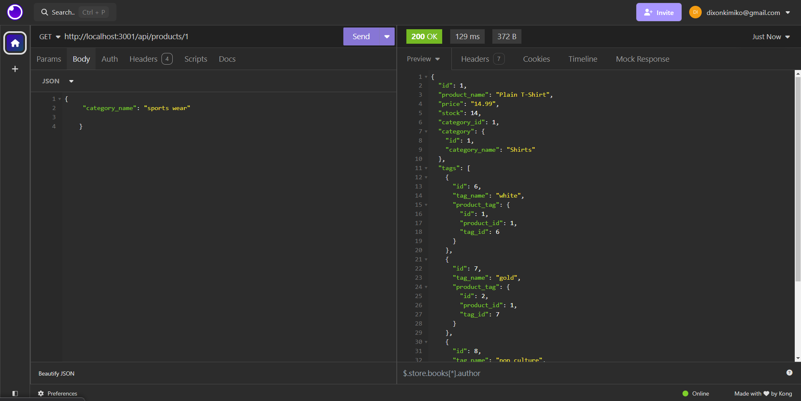
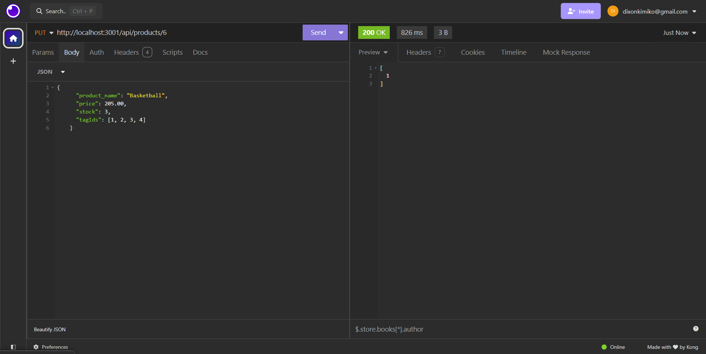

# 13 Object-Relational Mapping (ORM): E-Commerce Back End

## Description

This backend application allows the user to view and modify category, product, and tag information for an online store.

## Installation

To install necessary dependencies, run the following command:

...

'npm i'
...

## Usage

To use this application, open a terminal, log into the database, and run the schema.sql file. Then, seed the database and run the server. Enter the various routes to view, edit, create, or delete data. The category get routes should include product data, the product get routes should include the category and tag data, and the tag get routes should include product data.To end the program press 'Control + C'.

[Walkthrough](https://drive.google.com/file/d/1JQ9BoXuPeCFa7cO78yFstJtyRlQ7yXaK/view?usp=sharing)
## Credits

N/A

## License

LICENSE in repo.

